
<link href="assets/font-awesome.min.css" rel="stylesheet"/>

# A decade in certificate transparency and what may come next

---
<!-- header: Disclaimer -->

# Disclaimer

I am not affiliated with any party mentioned in this talk!
Views expressed here are my own.
I do not claim to represent the CT ecosystem as a whole.

---
<!-- header: Prior talks -->

# Prior talks

- There are multiple good talks on CT. Go watch them!
    - [Everything you always wanted to know about Certificate Transparency](https://media.ccc.de/v/33c3-8167-everything_you_always_wanted_to_know_about_certificate_transparency)
    - [Who watches the watchers in Web PKI?](https://media.ccc.de/v/emf2018-352-who-watches-the-watchers-in-web-pki)
- These talks focus on the protocol itself and the ongoing rollout
- This talk will focus on what happened since

---
## Motivation
<!-- header: Motivation -->

# Why Certificate Transparency?

---

## Situation around 2016: 
Any root certificate authority (and many intermediate CAs) can issue a certificate for any website 

- There are ~180 root CAs in the trust store
- ~1800 intermediate CAs

Any of those could potentially maliciously issue a certificate which could be used to do a MitM attack on a TLS connection.

---

## This is not a theoretic threat!

Canonical example: [DigiNotar](https://en.wikipedia.org/wiki/DigiNotar#Issuance_of_fraudulent_certificates) (2011)

TL;DR: 
- They got infiltrated
- Attackers issued certificates against at least 531 domains
- Including `*.google.com`, `*.windowsupdate.com`, `*.mozilla.org`
- Very delayed response by the company
- They got kicked out of trust store and went bankrupt
- Certificates where used for attacks in Iran

--- 

## The problem:

Trusting CAs to keep a record of all the certificates they issued and investigate breaches is insufficient.

**We need a public record of all issued certificates!**

---

## Certificate transparency to the rescue!

Idea:
- Certificates need to be logged in a publicly verifiable audit log
- Certificates embed some artifact that "proves" they have been logged
- Standardized in [RFC 6962](https://datatracker.ietf.org/doc/rfc6962/)
- There are more ways to use CT but they have not seen adoption

---

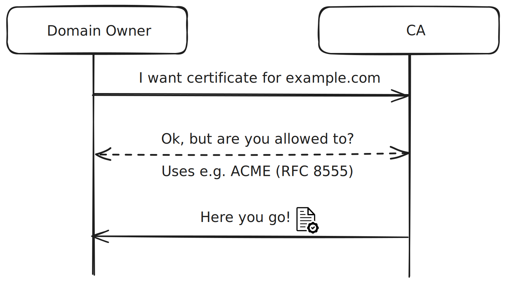

---

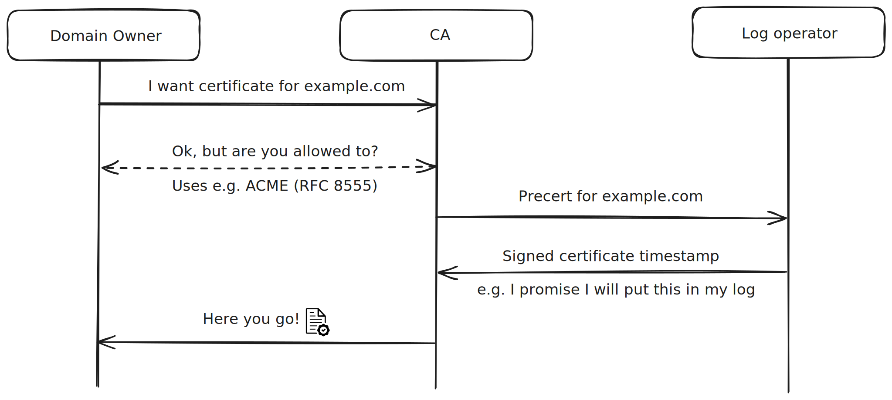

---

## Certificate transparency

- Log operators include certs in a merkle tree
- Entries can be precerts or full certificates (cross-posting)
- Logs regularly publish a signed tree head (STH)

---

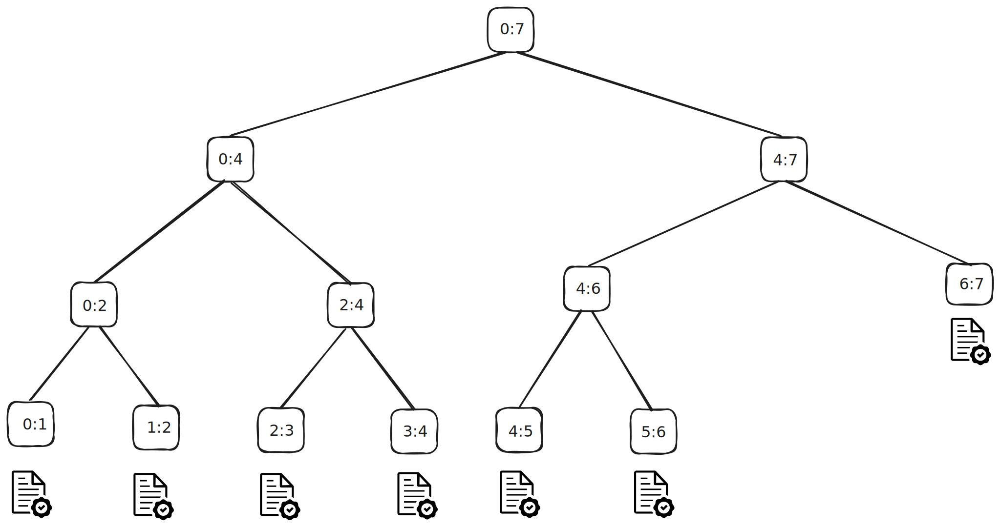

---

## Validating logs

- Request and validate signed tree head against public key
- Request inclusion proof, check that cert is in the log
- Request extension proof, check that new STH is extension of log

---

## Situation in 2026

- Browsers maintain a list of logs (url + pubkey) they recognize
- Certs require 2 (if TTL < 180 Days) or 3 valid SCTs
- Otherwise they will reject the certificate

---

## Situation in 2026

# Mission accomplished?

CT is widely deployed.
So are we done here?

---

## What is left to do?

Spoiler alert: A lot!

- Some issues emerged over time
- Some ideas from original design have seen adoption

---
<!-- header: Log operators -->

# Log operators

---

## Current log operators

- Google (US)
- Cloudflare (US)
- Digicert (US)
- Sectigo (US)
- Let's Encrypt (US)
- TrustAsia (China)
- Geomys (??)
- IPng Networks (Switzerland)

--- 

<iframe class="cf-radar-embed" width="800" height="616" src="https://radar.cloudflare.com/embed/DataExplorerVisualizer?dataset=ct&path=ct%2Ftimeseries_groups%2Flog_operator&dateRange=52w&param_limitPerGroup=20&locale=en-US&widgetState=%7B%22xy.hiddenSeries%22%3A%5B%5D%7D&ref=%2Fexplorer%3FdataSet%3Dct%26groupBy%3Dlog_operator%26dt%3D52w" title="Cloudflare Radar - Certificates by CT log operator time series for Worldwide" loading="lazy" style="border:0;max-width:100%;">
</iframe>

---

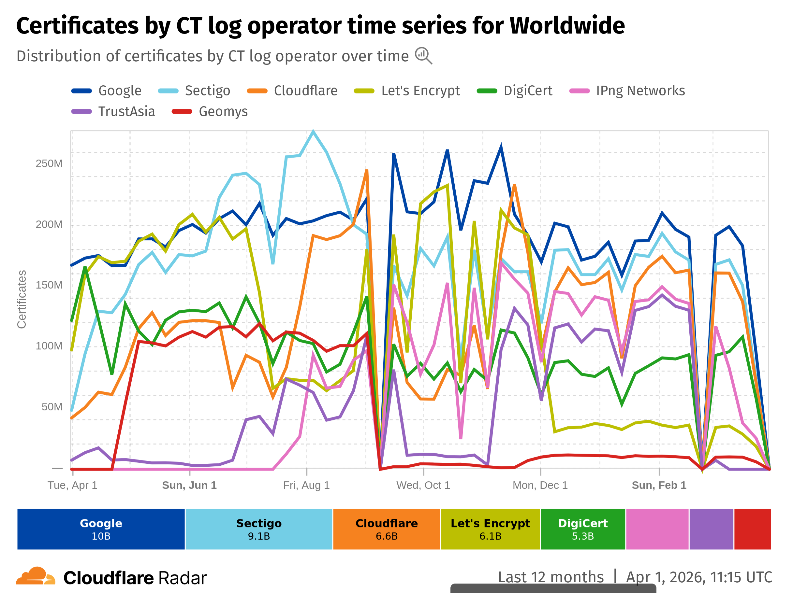

---

## Log operator lists

- Chromiums `log_list.json` has effectively become the consensus
- Is served at [https://www.gstatic.com/ct/log_list/v3/log_list.json](https://www.gstatic.com/ct/log_list/v3/log_list.json)
- The list is vendored into Chromium and Firefox
- Safari: [https://valid.apple.com/ct/log_list/current_log_list.json](https://valid.apple.com/ct/log_list/current_log_list.json)

---

## How to become a log operator

[Chromium Certificate Transparency Log Policy](https://googlechrome.github.io/CertificateTransparency/log_policy.html): 
- Write an application to Chromium (via bug tracker)
- Submit contact info, pubkeys, urls, maximum merge delay etc
- Keep the log running, Google will test is regularly
- Follow the mailing lists
- Maintain 99% uptime

---

## Log operators

- Each log operator runs multiple logs
- Logs accept certs with specific expiration dates (temporal sharding)
- Shard length between 3 Month and 1 Year
- Usually 2 logs per operator per shard

---

## Governance

Via two google groups:
    - [certificate-transpareny](https://groups.google.com/g/certificate-transparency) for general discussions
    - [ct-policy](https://groups.google.com/a/chromium.org/g/ct-policy/) for coordination between browser vendors and log operators

This works generally very well.

---
<!-- header: Log lists -->

# Log lists

---

## Log list schema

The schema is not part of the standard but ad-hoc invention by the Chromium team.

**This has created problems**

---

## Issue with fetching log lists

Actual incident:

- There is an android library for CT enforcement
- Google changes schema from v2 to v3
- Developers forget to update library
- App breaks, 100+ million of user affected

---

## Workaround

- Google added two fake logs to v2 called mimics
- Published the private keys
- Allows CAs to generate 2 fake SCTs
- Should be combined with 2 real SCTs

---

## Distributing log lists
Log lists have a kind of chicken and egg problem:

- Clients must have the list to make connections

But:

- How to fetch the list without making connections?

---

## Web browser clients

- Initial log list is vendored via package mangager, app store etc.
- Update log list via HTTPs request
- Deactivate CT enforcement if list is 70 days out of date

**UX wise good decision, but can prevent CT usage altogether**

---

## Non web browser clients

- Google claims that CT should only be used in browsers

But on the other hand:

- **CT may have mitigated [Notepad++ attack!](https://sscsecurity.dev/book1/chapter-07/ch-7.9/)**

---
<!-- header: Standard -->

# Development of the standard

---

## Logs v2

New [RFC 9162](https://datatracker.ietf.org/doc/rfc9162/)

- Obsoletes RFC 6962
- Mostly concerned with cryptoagility
- 5 years of delay
- "Too little, too late" - The authors
- **Was never adopted :(**

---

## Static-ct API

Problem: RFC 6962 API requires server to compile proofs
- Requires computational resources on server
- Bad for caching

Solution: Store merkle tree in a static file format
- Read path of log is a static file server
- Can be georeplicated
- CDNs can cache the files

**This is being rolled right now. Currently RFC 6962 and [static-ct](https://github.com/C2SP/C2SP/blob/main/static-ct-api.md) logs coexist**

---

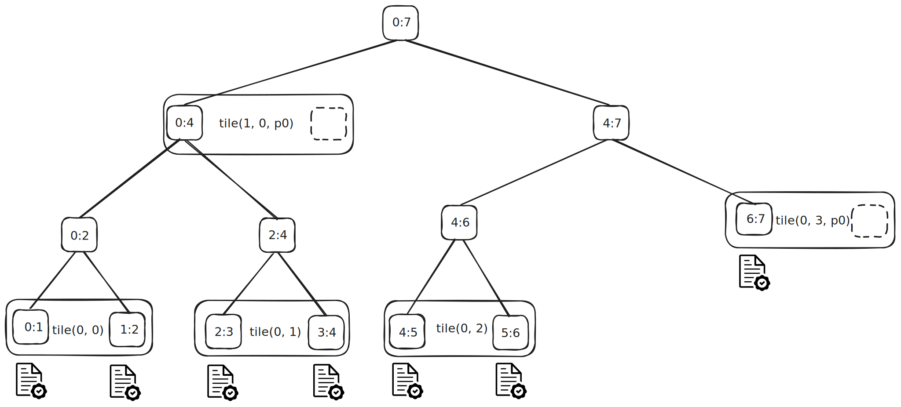

---

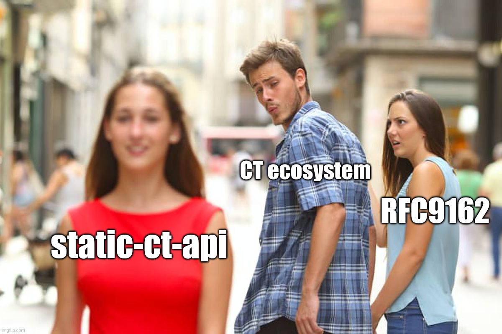

---
<!-- header: Adoption -->

# Adoption 

---

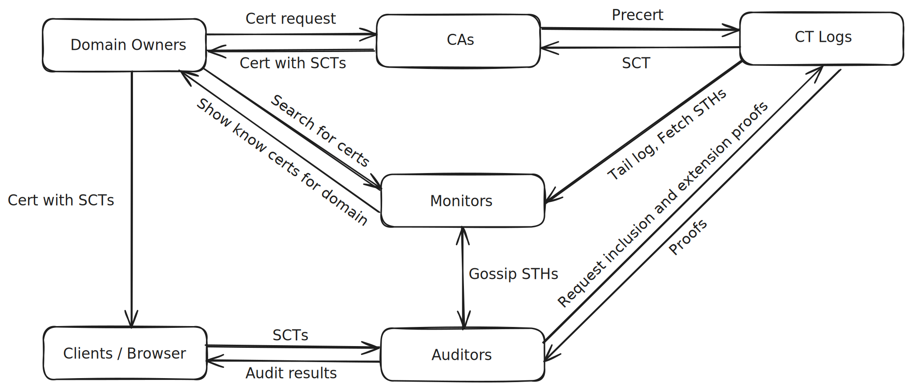

---

## Monitors
- Follow (tail) logs
- Some offer search engines such as [crt.sh](https://crt.sh)
- Some offer to send E-Mails if certs are issued
- Should be used by domain owners to validate certificate issuance

They exist and are being used to some degree

---

## Auditing

- There is no cryptographic link between an SCT and the log entry
- Browsers do not check the log entries corresponding to an SCT
- Chromium seems to have a random checking mechanism
- External auditing services exist but not used widely

--- 

## Why browsers don't check logs

Scalability:
- It's an "interactive" proof against an STH
- What is the failure mode if logs are offline?
- ~100KB traffic per proof.
    Acceptable for user, but insane amount of traffic on a log

Privacy: 
- Asking a log for a proof gives away which website is visited

---

## Gossiping

- Forking is computationally cheap (this is not a blockchain)
- To prevent / detect forked logs requires clients to exchange STHs
- Existing standards are quite handwavy about this

---

## Gossip is not really a thing yet

- There is a document from IETF
    - [draft-ietf-trans-gossip-05](https://datatracker.ietf.org/doc/draft-ietf-trans-gossip/)
- It names 3 gossiping methods
    - SCT feedback: Send SCT to an auditor via server
    - STH pollination: Clients share STHs via pools
    - Trusted Auditor relationship
- **Latest revision 2018-01-14 :(**

---

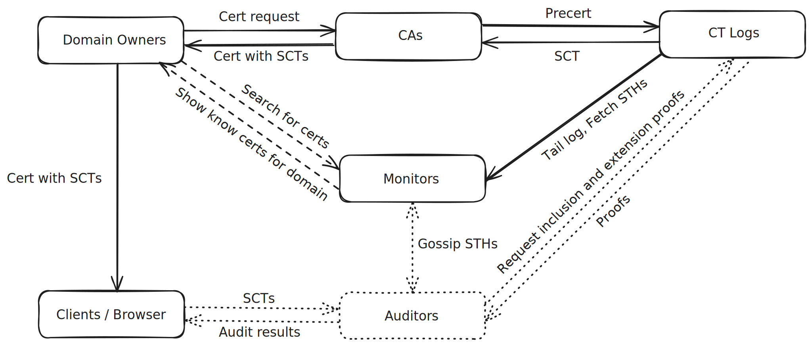

---

# TL;DR:

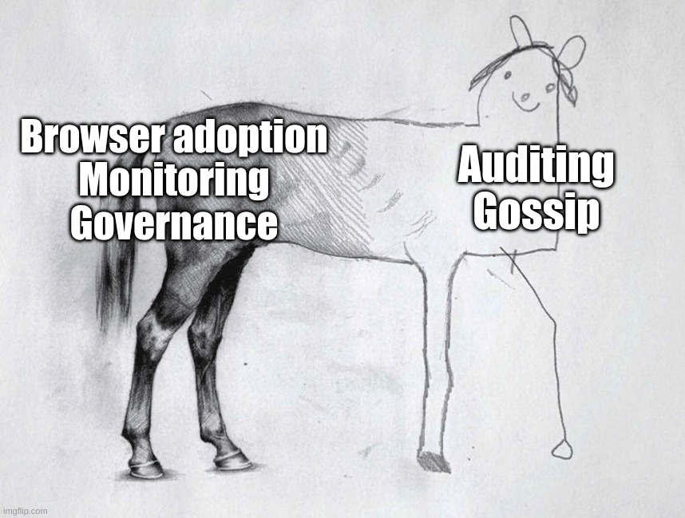

---

### Conclusion

A threat actor could mount an attack by coercing 1 root CA + 2 CT logs

- Fake SCTs are very likely not be detected
- Selectively serving a forked log will very likely not be detected

It is relatively easy to become a log operator (and it should be!).

---
<!-- header: luCT -->

## Auditing directly in the browser

# luCT 

---

## What can we do?

- Browsers (and other clients) should be able to audit the log
- Should not be the default behavior
- People at risk should be able to do this nonetheless
- There should be a gossiping mechanism

Note that the log data is public. We can build those things!
No need for more standardization!

---

## luCT

- Firefox extension
- Keeps record of STHs, checks extension proofs
- Fetches SCTs from TLS handshakes
- Fetches and validates inclusion proofs from logs

---

    <video id="luct-demo1" width="95%" autoplay muted>
        <source src="vids/luct_demo.mp4" type="video/mp4" />
    </video>
    <button class="stylish-button" onClick="(function(){
            const video = document.getElementById('luct-demo1');
            video.currentTime = 0;
            video.play();
            return false;
        })();">
        <i class="fa fa-rotate-left" aria-hidden="true"></i>
    </button>

---

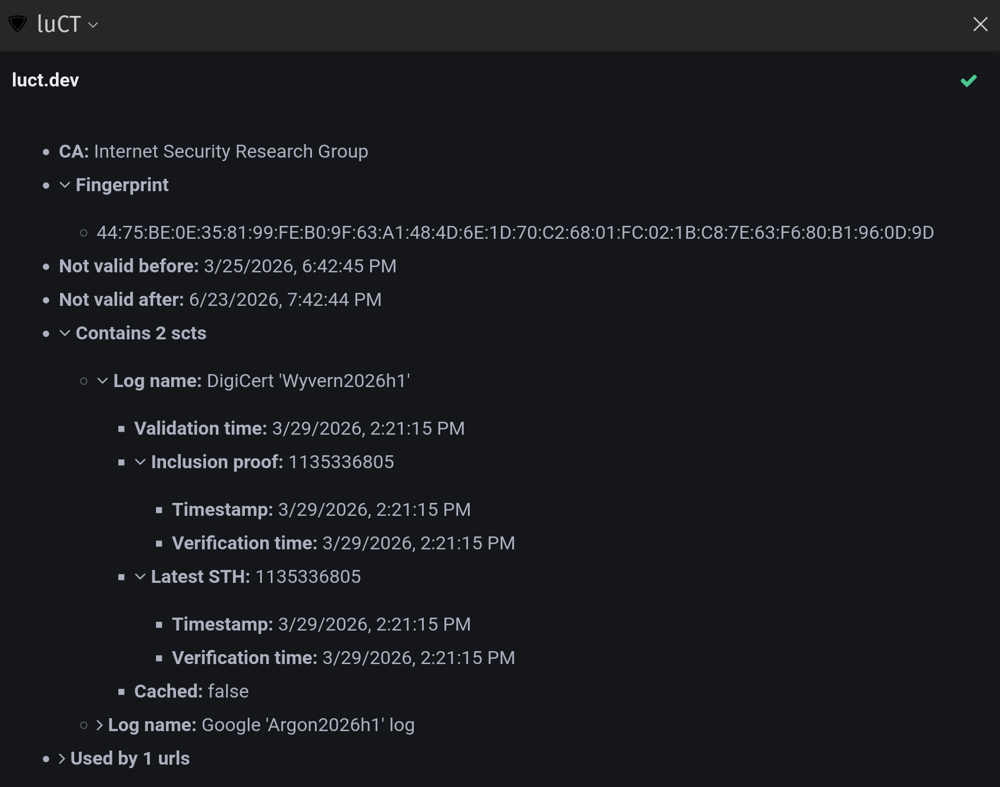

---

## Privacy

Oblivious proxy (WIP):

- Uses two layers of TLS (TLS stack compiled into wasm)
- Outer TLS connection to a proxy
- Sends WebSocket data, which is forwarded as raw TCP
- Uses inner TLS connection to connect to the log
- Proxy knows IP address, log knows requested SCT

**If you can, use proper VPN or TOR :P**

---
## Security policy

- Let N = 2 if TTL $\leq$ 180d, else N = 3
- Cert contains N SCTs from known logs with matching signatures
- K SCTs validate against log
- SCT validates against log iff:
    - There is STH newer than 24h or log is readonly
    - SCT validated against oldest possible STH
    - Extension proof of old STH to new STH was checked
    - K = 1 if validated against STH $\geq$ 24h, else K = N
    - STH age by own timestamps NOT included timestamps

---

## Gossip

Nope, not yet!

Idea:
- Fleet of checkpoint servers fetch STHs at random
- luCT fetches new STHs from checkpointers
- Fetches extension proofs of the timeline

---

Scenario | Attack requirement | Attack
-----|------|------
CA only (2016) | 1 CA | Rogue cert
CA + CT (today) | 1 CA + 2 CT | Rogue cert + fake SCTs
CA + CT + luCT (soon) | 1 CA + 2 CT  | Rogue cert + forked logs
CA + CT + luCT + Gossip | 1 CA + 2 CT + checkpointer | Full eclipse?

---

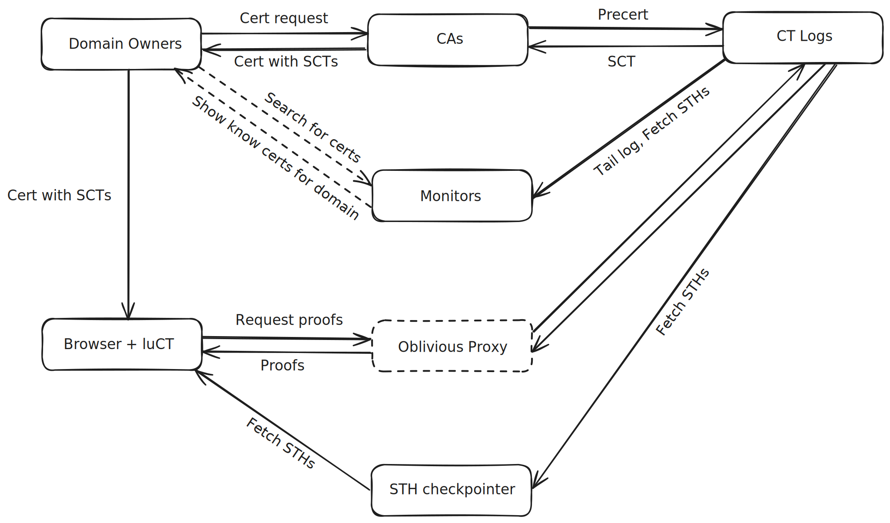

---

## There is one issue left

What if an attacker just submits a rogue certificate to honest logs, but the domain owners don't care to ever check logs for rogue certificates?

Idea:

- Check CAA ([RFC 8659](https://datatracker.ietf.org/doc/rfc8659/)) and TLSA ([RFC 6698](https://datatracker.ietf.org/doc/rfc6698/)) records via DNS over HTTPs
- Display special icon if matching entries exist
- Motivate admins to use them (and registrars to support them!)

---

## Definitely try this at home!

- If you are a website admin / domain owner: 
    - Check [crt.sh](https://crt.sh) and subscribe to E-Mail alert (e.g. cloudflare)
- Consider becoming a log operator
- If you can put up with half backed software:
    - Try out luCT!
    - Help wanted!
    - **Keep in mind this is pre-alpha software!**

---
<!-- header: Outlook -->

# Outlook

---

## Improve certificate transparency

Some ideas from me:

- CT logs with private information retrieval
- Content addressable tiles
- Standardize log list management

---

## Other applications

Transparency logs have applications outside of CT

- Software transparency logs (both source and binary distribution)
    - Go checksum database
- Key transparency logs
    - Keybase
    - WhatApp 

---

## Using transparency logs as certificates

Draft: [draft-ietf-plants-merkle-tree-certs-02](https://datatracker.ietf.org/doc/draft-ietf-plants-merkle-tree-certs/02/)

Idea:
- CAs run their own logs
- Replace certificate signatures with inclusion proofs
- Negotiate which tree head in TLS client hello

**Motivated by large signatures of post-quantum crypto**

---

<!-- header: Question? -->

# TYSM!!

## Questions?

## Lets stay in touch!

<i class="fa fa-at" aria-hidden="true"></i> [luct.dev](https://luct.dev)
<i class="fa fa-github" aria-hidden="true"></i> [github.com/Sawchord/luct](https://github.com/Sawchord/luct)
<i class="fa fa-comment" aria-hidden="true"></i> [#luct:matrix.org](https://matrix.to/#/#luct:matrix.org)

Slides:

[luct.dev/prez.html](https://luct.dev/prez.html)

 

